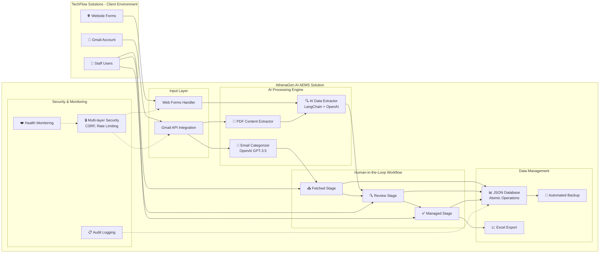
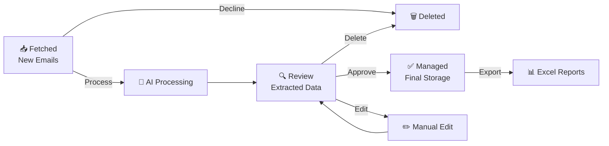

# ΠΑΡΟΥΣΙΑΣΗ ΛΥΣΗΣ ΑΥΤΟΜΑΤΙΣΜΟΥ
## AEMS - Agentic Email Management System για TechFlow Solutions

---

### ΛΥΣΗ ΑΥΤΟΜΑΤΙΣΜΟΥ ΓΙΑ TECHFLOW SOLUTIONS
**AEMS - Agentic Email Management System**

**Παρουσιάζει**: Αλέξανδρος Λιάσκος

**Πελάτης**: TechFlow Solutions (50-100 εργαζόμενοι)

**Περιεχόμενο Παρουσίασης:**
- Ανάλυση Αναγκών Πελάτη
- Τεχνική Πρόταση & Αρχιτεκτονική
- Πλήρης Υλοποιημένη Λύση
- Οικονομική Ανάλυση & ROI

**Ημερομηνία**: Αύγουστος 2025

---

### ΤΡΕΧΟΥΣΑ ΚΑΤΑΣΤΑΣΗ - TECHFLOW SOLUTIONS

**Κλάδος**: Παροχή IT Υπηρεσιών
**Μέγεθος**: 50-100 εργαζόμενοι
**Κύριο Πρόβλημα**: Χειροκίνητη διαχείριση δεδομένων

#### Καθημερινές Προκλήσεις:
- 📧 **Customer inquiries** μέσω email και website forms
- 📄 **PDF τιμολόγια** που απαιτούν χειροκίνητη επεξεργασία
- ⏱️ **Σημαντικός χρόνος** σε χειροκίνητη data entry
- ❌ **Υψηλός κίνδυνος λαθών** και καθυστερήσεων

---

### ΚΟΣΤΟΣ ΤΡΕΧΟΥΣΑΣ ΚΑΤΑΣΤΑΣΗΣ

#### Άμεσες Επιπτώσεις:
- **Σημαντικό κόστος** σε staff time και errors
- **Καθυστερήσεις** στην απόκριση πελατών
- **Χαμένες ευκαιρίες** λόγω αργής επικοινωνίας
- **Scalability bottleneck** - αδυναμία ανάπτυξης

#### Κρυφά Κόστη:
- Stress και burnout προσωπικού
- Ποιότητα δεδομένων και consistency issues
- Competitive disadvantage στην αγορά
- Compliance risks σε financial reporting

---

### AGENTIC EMAIL MANAGEMENT SYSTEM

#### 🤖 **AI-Powered Automation**
- OpenAI GPT-3.5-turbo για intelligent processing
- Αυτόματη εξαγωγή customer data και invoice information

#### 👥 **Human-in-the-Loop Control**
- Τριπλό στάδιο ελέγχου: Fetched → Review → Managed
- Complete user oversight σε κάθε βήμα
- Manual edit capabilities για fine-tuning

#### 🔒 **Enterprise Security & Compliance**
- GDPR-compliant data handling
- Multi-layer security με comprehensive audit trails
- Automated backup και disaster recovery

---

### ΕΠΙΣΚΟΠΗΣΗ ΑΡΧΙΤΕΚΤΟΝΙΚΗΣ ΣΥΣΤΗΜΑΤΟΣ



#### Βασικές Τεχνολογίες:
- **Backend**: Node.js Express με αρθρωτή αρχιτεκτονική
- **AI**: OpenAI + LangChain ενσωμάτωση
- **Βάση Δεδομένων**: JSON-based με ατομικές λειτουργίες
- **Ασφάλεια**: Helmet.js, CSRF, περιορισμός ρυθμού

---

### ΒΑΣΙΚΑ ΧΑΡΑΚΤΗΡΙΣΤΙΚΑ & ΔΥΝΑΤΟΤΗΤΕΣ

#### 📊 **Dashboard & Παρακολούθηση**
- Κατάσταση επεξεργασίας email σε πραγματικό χρόνο
- Ζωντανές ειδοποιήσεις για νέα emails
- Αναλυτικά στοιχεία απόδοσης και μετρήσεις
- Παρακολούθηση υγείας με αυτοματοποιημένες ειδοποιήσεις

#### 🔄 **Έξυπνη Επεξεργασία**
- Αυτόματη κατηγοριοποίηση email (Ερωτήσεις Πελατών, Τιμολόγια, Άλλα)
- Εξαγωγή δεδομένων AI από περιεχόμενο email και PDF συνημμένα
- Επεξεργασία σε δέσμες για αποδοτικότητα
- Εντοπισμός σφαλμάτων και μηχανισμοί αποκατάστασης

#### 📈 **Εξαγωγή & Ενσωμάτωση**
- Εξαγωγή Excel με προσαρμόσιμα πρότυπα
- Υπολογιστικά φύλλα πολλαπλών καρτελών ανά κατηγορία
- Έτοιμο API για μελλοντικές ενσωματώσεις
- Ολοκληρωμένα ίχνη ελέγχου

---

### ΠΛΗΡΗΣ ΣΥΣΤΗΜΑ ΕΛΕΓΧΟΥ ΧΡΗΣΤΗ

#### Στάδια Ροής Εργασίας:


#### Έλεγχοι Χρήστη:
- **Έγκριση/Απόρριψη** σε κάθε στάδιο
- **Χειροκίνητη επεξεργασία** όλων των εξαγόμενων πεδίων
- **Μαζικές λειτουργίες** για αποδοτικότητα
- **Πλήρες ίχνος ελέγχου** όλων των ενεργειών

---

### ΕΞΥΠΝΗ ΕΞΑΓΩΓΗ ΔΕΔΟΜΕΝΩΝ

#### Επεξεργασία Ερωτήσεων Πελατών:
- **Όνομα Πελάτη** - Αυτόματη εξαγωγή από υπογραφές email
- **Στοιχεία Επικοινωνίας** - Email, τηλέφωνο, στοιχεία εταιρείας
- **Ενδιαφέρον Υπηρεσίας** - Ανάλυση περιεχομένου email για ανάγκες υπηρεσιών
- **Ταξινόμηση Προτεραιότητας** - Επείγον, κανονικό, χαμηλή προτεραιότητα

#### Επεξεργασία Τιμολογίων:
- **Ανάλυση Περιεχομένου PDF** - Εξαγωγή κειμένου από συνημμένα
- **Οικονομικά Δεδομένα** - Αριθμός τιμολογίου, ημερομηνία, ποσά, ΦΠΑ
- **Αντιστοίχιση Πελατών** - Διασταυρούμενη αναφορά με υπάρχοντα δεδομένα
- **Κανόνες Επικύρωσης** - Αυτόματος εντοπισμός σφαλμάτων

#### Δίγλωσση Υποστήριξη:
- **Ελληνικά & Αγγλικά** επεξεργασία κειμένου
- **Μικτό περιεχόμενο** χειρισμός
- **Πολιτισμικό πλαίσιο** επίγνωση

---

### ΑΣΦΑΛΕΙΑ ΕΠΙΧΕΙΡΗΜΑΤΙΚΟΥ ΕΠΙΠΕΔΟΥ

#### Προστασία Δεδομένων:
- **Συμμόρφωση GDPR** - Πλήρης συμμόρφωση προστασίας δεδομένων
- **Κρυπτογράφηση** - Δεδομένα σε ηρεμία και κίνηση
- **Έλεγχος Πρόσβασης** - Δικαιώματα βάσει ρόλων
- **Καταγραφή Ελέγχου** - Πλήρης παρακολούθηση δραστηριοτήτων

#### Ασφάλεια Συστήματος:
- **OAuth2 Αυθεντικοποίηση** - Ασφαλής ενσωμάτωση Gmail
- **Προστασία CSRF** - Πρόληψη cross-site request forgery
- **Περιορισμός Ρυθμού** - Προστασία από DDoS
- **Καθαρισμός Εισόδου** - Πρόληψη XSS επιθέσεων

#### Συνέχεια Επιχειρήσεων:
- **Αυτοματοποιημένα Αντίγραφα** - Καθημερινά με επαλήθευση ακεραιότητας
- **Αποκατάσταση Καταστροφών** - Πλήρης αποκατάσταση συστήματος
- **Παρακολούθηση Υγείας** - Προληπτικός εντοπισμός προβλημάτων
- **Αποκατάσταση Σφαλμάτων** - Αυτόματοι μηχανισμοί επανάληψης

---

### ΠΛΗΡΗΣ ΛΥΣΗ - ΗΔΗ ΥΛΟΠΟΙΗΜΕΝΗ

#### **✅ Ολοκληρωμένα Χαρακτηριστικά:**
- Gmail OAuth2 integration με automatic token refresh
- AI-powered categorization (OpenAI GPT-3.5-turbo)
- PDF content processing και data extraction
- Human-in-the-loop workflow (Fetched → Review → Managed)
- Real-time dashboard με notifications
- Excel export functionality
- Enterprise security (CSRF, rate limiting, audit logging)
- Automated backup system
- Health monitoring και performance metrics

#### **📋 Έτοιμο για Deployment:**
- Πλήρης working solution
- Comprehensive documentation
- User manual στα ελληνικά
- Security features enabled
- Production-ready codebase

---

### INVESTMENT & ROI ANALYSIS

#### **Απαιτήσεις Επένδυσης (Ετήσια Κόστη)**
```
AI Υπηρεσίες (OpenAI API):     €500 - €1,500
Hosting (απλός server):        €200 - €500
Συντήρηση (περιστασιακή):      €500 - €1,000
─────────────────────────────────────────────
Συνολικό Ετήσιο Κόστος:       €1,200 - €3,000
```

#### **Αναμενόμενες Εξοικονομήσεις**
- **Μείωση χειροκίνητης εργασίας** - Σημαντική εξοικονόμηση χρόνου
- **Λιγότερα λάθη** - Μείωση κόστους διορθώσεων
- **Ταχύτερες αποκρίσεις** - Καλύτερη διατήρηση πελατών
- **Βελτιωμένη κλιμάκωση** - Χειρισμός περισσότερου όγκου χωρίς επιπλέον προσωπικό

#### **Προσδοκίες ROI**
- **Σημείο ισοσκέλισης**: 6-12 μήνες (εκτιμώμενο)
- **Μακροπρόθεσμα οφέλη** - Κλιμάκωση και ανταγωνιστικό πλεονέκτημα
- **Μετρήσιμες εξοικονομήσεις** - Να μετρηθούν κατά την υλοποίηση

---

### ΜΕΤΡΗΣΙΜΟΣ ΕΠΙΧΕΙΡΗΜΑΤΙΚΟΣ ΑΝΤΙΚΤΥΠΟΣ

#### **Άμεσα Αποτελέσματα (0-3 μήνες)**
- **Σημαντική μείωση χρόνου**: Αυτοματοποίηση διαδικασιών εισαγωγής δεδομένων
- **Βελτίωση ακρίβειας**: Μείωση ανθρώπινων σφαλμάτων στην καταγραφή
- **Ταχύτερη απόκριση**: Γρηγορότερη επεξεργασία ερωτήσεων πελατών
- **Άμεσες εξοικονομήσεις**: Μείωση κόστους χειροκίνητης εργασίας

#### **Μεσοπρόθεσμα Οφέλη (3-12 μήνες)**
- **Αυξημένη χωρητικότητα**: Χειρισμός περισσότερων emails χωρίς επιπλέον προσωπικό
- **Επιχειρηματική Νοημοσύνη**: Αυτοματοποιημένα αναλυτικά στοιχεία και γνώσεις πελατών
- **Τυποποίηση Διαδικασιών**: Συνεπείς, επαναλήψιμες ροές εργασίας
- **Ανταγωνιστικό Πλεονέκτημα**: Διαφοροποίηση αγοράς μέσω αποδοτικότητας

#### **Μακροπρόθεσμα Οφέλη (12+ μήνες)**
- **Επέκταση Αγοράς**: Χωρητικότητα για νέες αγορές και υπηρεσίες
- **Πλατφόρμα Καινοτομίας**: Θεμέλιο για προηγμένες δυνατότητες AI
- **Στρατηγική Ανάπτυξη**: Κλιμακώσιμη υποδομή για επιχειρηματική επέκταση

---

### ΟΛΟΚΛΗΡΩΜΕΝΗ ΔΙΑΧΕΙΡΙΣΗ ΚΙΝΔΥΝΩΝ

#### **Εντοπισμένοι Κίνδυνοι & Μετριασμός**

| Κατηγορία Κινδύνου | Κίνδυνος | Στρατηγική Μετριασμού |
|-------------------|----------|---------------------|
| **Τεχνικός** | Αξιοπιστία AI API | Μηχανισμοί εφεδρείας, τοπική επεξεργασία |
| **Τεχνικός** | Απόδοση συστήματος | Δοκιμές φορτίου, κλιμακώσιμη αρχιτεκτονική |
| **Επιχειρηματικός** | Υιοθέτηση χρηστών | Ολοκληρωμένη εκπαίδευση, διαχείριση αλλαγών |
| **Επιχειρηματικός** | Ποιότητα δεδομένων | Κανόνες επικύρωσης, ανθρώπινη εποπτεία |
| **Λειτουργικός** | Καθυστερήσεις χρονοδιαγράμματος | Ευέλικτη μεθοδολογία, χρόνος ασφαλείας |
| **Λειτουργικός** | Διεύρυνση εύρους | Συμβόλαιο σταθερής τιμής, σαφή παραδοτέα |

#### **Εγγυήσεις Επιτυχίας**
- **KPIs Απόδοσης**: Μετρήσιμες μετρικές επιτυχίας
- **Ικανοποίηση Χρηστών**: Στόχος >90% ποσοστό υιοθέτησης
- **Οικονομικές Εγγυήσεις**: Δέσμευση επίτευξης ROI
- **Τεχνική Υποστήριξη**: 12μηνη περιλαμβανόμενη υποστήριξη

---

### ΧΑΡΤΗΣ ΠΟΡΕΙΑΣ ΥΛΟΠΟΙΗΣΗΣ

#### **Άμεσες Ενέργειες (Εβδομάδα 1)**
1. **Έγκριση Έργου** - Οριστικοποίηση συμβολαίου και έγκριση προϋπολογισμού
2. **Συγκρότηση Ομάδας** - Ανάθεση ενδιαφερομένων μερών και πρωταγωνιστών έργου
3. **Ρύθμιση Περιβάλλοντος** - Προετοιμασία περιβαλλόντων ανάπτυξης και δοκιμών
4. **Συνάντηση Έναρξης** - Ευθυγράμμιση προσδοκιών και πρωτοκόλλων επικοινωνίας

#### **Κρίσιμοι Παράγοντες Επιτυχίας**
- **Δέσμευση Διοίκησης** - Εκτελεστική χορηγία και υποστήριξη
- **Συμμετοχή Προσωπικού** - Ενεργή συμμετοχή στο πρόγραμμα εκπαίδευσης
- **Σαφής Επικοινωνία** - Τακτικές ενημερώσεις και βρόχοι ανατροφοδότησης
- **Συνεχής Παρακολούθηση** - Παρακολούθηση απόδοσης και βελτιστοποίηση

#### **Η Ευκαιρία**
**Η TechFlow Solutions βρίσκεται σε κρίσιμο σημείο ανάπτυξης.**
**Το AEMS προσφέρει τη δυνατότητα να αυτοματοποιήσει, να βελτιώσει, να κλιμακώσει και να ενισχύσει την ανταγωνιστικότητα.**

**Η επένδυση στο AEMS σήμερα θα καθορίσει την επιτυχία της TechFlow Solutions αύριο.**

---

### ΕΥΧΑΡΙΣΤΟΥΜΕ ΓΙΑ ΤΗΝ ΠΡΟΣΟΧΗ ΣΑΣ

#### **Ερωτήσεις & Συζήτηση**
- Τεχνικές λεπτομέρειες και λεπτομέρειες υλοποίησης
- Επιλογές προσαρμογής και μελλοντικές βελτιώσεις
- Απαιτήσεις εκπαίδευσης και επιλογές υποστήριξης
- Προσαρμογές χρονοδιαγράμματος και κατανομή πόρων

#### **Επόμενα Βήματα**
1. **Συνεδρία Ερωτήσεων-Απαντήσεων** - Απαντήσεις σε ερωτήσεις
2. **Τεχνική Εμβάθυνση** - Λεπτομερής τεχνική παρουσίαση
3. **Συζήτηση Πιλοτικού** - Επιλογές πιλοτικού προγράμματος
4. **Οριστικοποίηση Συμβολαίου** - Όροι και προϋποθέσεις

#### **Επικοινωνία**
- **Email**: alexliaskosga@gmail.com
- **Τηλέφωνο**: +30 6984101718
- **Περιβάλλον Demo**: Διαθέσιμο για πρακτικές δοκιμές
- **Τεκμηρίωση**: Ολοκληρωμένα τεχνικά και εγχειρίδια χρήστη

**Είμαστε έτοιμοι να ξεκινήσουμε αμέσως!**

---

*Παρουσίαση AEMS v1.0*
*TechFlow Solutions Automation Project*
*Ημερομηνία: Αύγουστος 2025*
