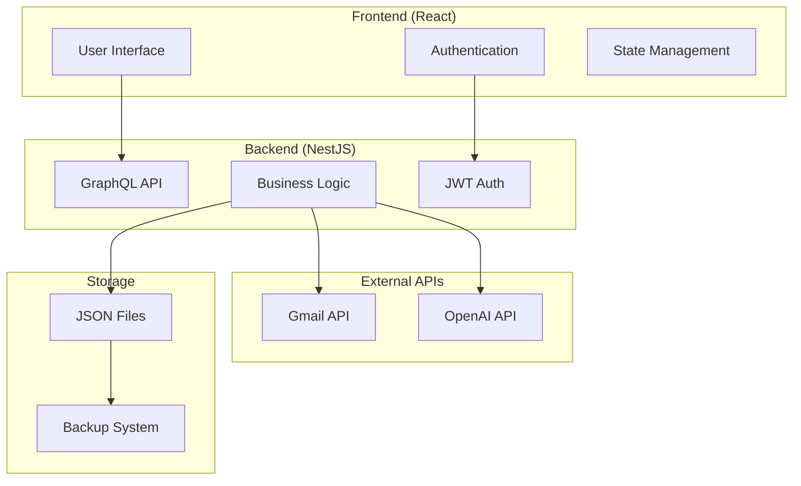
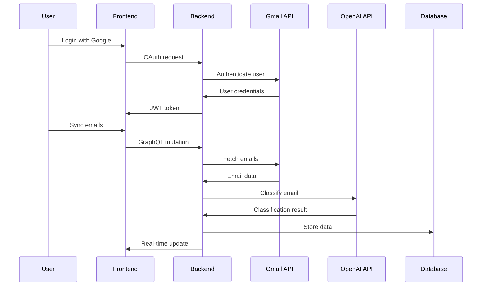

# AEMS - Automated Email Management System

[](https://www.typescriptlang.org/)
[](https://nestjs.com/)
[](https://reactjs.org/)
[](https://graphql.org/)
[](LICENSE)

> **Intelligent Email Processing with AI-Powered Classification and Data Extraction**

AEMS is a modern, full-stack email management system that leverages artificial intelligence to automatically categorize emails and extract structured data from invoices, receipts, and documents. Built with cutting-edge technologies and designed for zero-cost hosting with local data storage.

## 🚀 Features

### 🤖 AI-Powered Processing
- **Smart Classification** - Automatically categorize emails using GPT-3.5-turbo
- **Data Extraction** - Extract structured data from invoices, receipts, and documents
- **Human-in-the-Loop** - Review and approve AI decisions with confidence scores
- **Learning System** - Improves accuracy over time with user feedback

### 📧 Email Management
- **Gmail Integration** - Secure OAuth2 connection to Gmail API
- **Real-time Sync** - Automatic email fetching with rate limiting
- **Attachment Processing** - PDF and image attachment analysis
- **Workflow States** - Track emails through fetched → processing → review → approved → archived

### 🏗️ Modern Architecture
- **NestJS Backend** - Scalable Node.js framework with dependency injection
- **React Frontend** - Modern UI with TypeScript and ShadCN/RadixUI components
- **GraphQL API** - Type-safe API with real-time subscriptions
- **Local Storage** - JSON file-based database for zero hosting costs
- **Real-time Updates** - WebSocket notifications and live data sync

### 🔐 Security & Privacy
- **Local-First** - All data stored locally on your device
- **OAuth2 Security** - Secure Google authentication
- **JWT Tokens** - Stateless authentication with automatic refresh
- **Data Encryption** - Secure handling of sensitive information
- **Zero Cloud Dependencies** - No external database or storage required

## 📋 Table of Contents

- [Quick Start](#-quick-start)
- [Installation](#-installation)
- [Configuration](#-configuration)
- [Development](#-development)
- [Architecture](#-architecture)
- [API Documentation](#-api-documentation)
- [Deployment](#-deployment)
- [Contributing](#-contributing)
- [License](#-license)

## ⚡ Quick Start

### Prerequisites

- **Node.js** 18.0+ and npm 9.0+
- **Google Cloud Console** account for Gmail API
- **OpenAI API** key for AI processing

### 1. Clone and Install

```bash
# Clone the repository
git clone https://github.com/AlexandrosLiaskos/AEMS.git
cd AEMS

# Install dependencies
npm install

# Install workspace dependencies
npm run install:all
```

### 2. Environment Setup

```bash
# Copy environment template
cp .env.example .env

# Edit configuration
nano .env
```

### 3. Configure APIs

```bash
# Required environment variables
GOOGLE_CLIENT_ID=your_google_client_id
GOOGLE_CLIENT_SECRET=your_google_client_secret
OPENAI_API_KEY=your_openai_api_key
JWT_SECRET=your_jwt_secret
```

### 4. Start Development

```bash
# Start both backend and frontend
npm run dev

# Or start individually
npm run dev:backend    # Backend on http://localhost:3001
npm run dev:frontend   # Frontend on http://localhost:3000
```

### 5. Initial Setup

1. Open http://localhost:3000
2. Click "Get Started" and connect your Gmail account
3. Complete the onboarding process
4. Start processing emails!

## 🛠️ Installation

### System Requirements

- **Operating System**: Windows 10+, macOS 10.15+, or Linux
- **Node.js**: Version 18.0 or higher
- **Memory**: 4GB RAM minimum, 8GB recommended
- **Storage**: 1GB free space for application and data

### Detailed Installation

#### 1. Node.js Setup

```bash
# Using Node Version Manager (recommended)
curl -o- https://raw.githubusercontent.com/nvm-sh/nvm/v0.39.0/install.sh | bash
nvm install 18
nvm use 18

# Verify installation
node --version  # Should be 18.0+
npm --version   # Should be 9.0+
```

#### 2. Project Setup

```bash
# Clone repository
git clone https://github.com/AlexandrosLiaskos/AEMS.git
cd AEMS

# Install root dependencies
npm install

# Install all workspace dependencies
npm run install:all

# Verify installation
npm run build:check
```

#### 3. Google Cloud Console Setup

1. Go to [Google Cloud Console](https://console.cloud.google.com/)
2. Create a new project or select existing
3. Enable Gmail API
4. Create OAuth 2.0 credentials
5. Add authorized redirect URIs:
   - `http://localhost:3001/api/auth/google/callback` (development)
   - `https://yourdomain.com/api/auth/google/callback` (production)

#### 4. OpenAI API Setup

1. Visit [OpenAI Platform](https://platform.openai.com/)
2. Create an account and verify phone number
3. Generate API key in API Keys section
4. Add billing information (required for API access)

## ⚙️ Configuration

### Environment Variables

Create `.env` file in the project root:

```bash
# Application
NODE_ENV=development
PORT=3001
FRONTEND_URL=http://localhost:3000

# Database
DATABASE_TYPE=json
DATABASE_PATH=./data
BACKUP_ENABLED=true
BACKUP_RETENTION_DAYS=30

# Authentication
JWT_SECRET=your-super-secret-jwt-key-min-32-chars
JWT_EXPIRES_IN=7d
SESSION_SECRET=your-session-secret

# Google OAuth
GOOGLE_CLIENT_ID=your_google_client_id.apps.googleusercontent.com
GOOGLE_CLIENT_SECRET=your_google_client_secret
GOOGLE_REDIRECT_URI=http://localhost:3001/api/auth/google/callback

# OpenAI
OPENAI_API_KEY=sk-your-openai-api-key
OPENAI_MODEL=gpt-3.5-turbo
OPENAI_MAX_TOKENS=1000

# Gmail API
GMAIL_SCOPES=https://www.googleapis.com/auth/gmail.readonly
GMAIL_RATE_LIMIT=15000  # requests per minute

# Logging
LOG_LEVEL=info
LOG_FILE=./logs/aems.log

# Features
ENABLE_AI_PROCESSING=true
ENABLE_NOTIFICATIONS=true
ENABLE_METRICS=true
```

### Advanced Configuration

#### Database Configuration

```bash
# JSON File Database (default)
DATABASE_TYPE=json
DATABASE_PATH=./data

# SQLite Database (alternative)
DATABASE_TYPE=sqlite
DATABASE_PATH=./data/aems.db
```

#### AI Processing Configuration

```bash
# OpenAI Configuration
OPENAI_MODEL=gpt-3.5-turbo          # or gpt-4
OPENAI_MAX_TOKENS=1000              # Response length limit
OPENAI_TEMPERATURE=0.1              # Creativity (0-1)
OPENAI_TIMEOUT=30000                # Request timeout (ms)

# Classification Settings
CLASSIFICATION_CONFIDENCE_THRESHOLD=0.8
CLASSIFICATION_CATEGORIES=invoice,receipt,newsletter,personal,business

# Extraction Settings
EXTRACTION_CONFIDENCE_THRESHOLD=0.9
EXTRACTION_FIELDS=amount,date,vendor,invoice_number,tax
```

#### Performance Configuration

```bash
# Rate Limiting
GMAIL_RATE_LIMIT=15000              # Gmail API quota per minute
OPENAI_RATE_LIMIT=3000              # OpenAI API requests per minute
API_RATE_LIMIT=1000                 # General API rate limit

# Concurrency
MAX_CONCURRENT_EMAILS=5             # Parallel email processing
MAX_CONCURRENT_EXTRACTIONS=3        # Parallel data extraction
BATCH_SIZE=10                       # Email batch processing size

# Caching
CACHE_TTL=300                       # Cache time-to-live (seconds)
CACHE_MAX_SIZE=1000                 # Maximum cache entries
```

## 🔧 Development

### Project Structure

```
AEMS/
├── apps/
│   ├── backend/                    # NestJS backend application
│   │   ├── src/
│   │   │   ├── auth/              # Authentication module
│   │   │   ├── email/             # Email processing module
│   │   │   ├── ai/                # AI classification & extraction
│   │   │   ├── database/          # Local JSON storage
│   │   │   ├── notifications/     # Real-time notifications
│   │   │   └── common/            # Shared utilities
│   │   └── test/                  # Backend tests
│   └── frontend/                  # React frontend application
│       ├── src/
│       │   ├── components/        # Reusable UI components
│       │   ├── pages/             # Application pages
│       │   ├── providers/         # Context providers
│       │   ├── services/          # API services
│       │   └── styles/            # Global styles
│       └── public/                # Static assets
├── packages/
│   ├── shared/                    # Shared utilities
│   ├── types/                     # TypeScript type definitions
│   ├── constants/                 # Application constants
│   ├── utils/                     # Utility functions
│   └── ui/                        # Shared UI components
├── docs/                          # Documentation
├── scripts/                       # Build and deployment scripts
└── data/                          # Local data storage
```

### Development Commands

```bash
# Development
npm run dev                        # Start both backend and frontend
npm run dev:backend               # Start backend only
npm run dev:frontend              # Start frontend only

# Building
npm run build                     # Build all applications
npm run build:backend            # Build backend only
npm run build:frontend           # Build frontend only

# Testing
npm run test                      # Run all tests
npm run test:backend             # Run backend tests
npm run test:frontend            # Run frontend tests
npm run test:e2e                 # Run end-to-end tests

# Code Quality
npm run lint                      # Lint all code
npm run lint:fix                 # Fix linting issues
npm run format                   # Format code with Prettier
npm run type-check               # TypeScript type checking

# Database
npm run db:migrate               # Run database migrations
npm run db:seed                  # Seed database with test data
npm run db:backup                # Create database backup
npm run db:restore               # Restore from backup

# Utilities
npm run clean                    # Clean build artifacts
npm run reset                    # Reset node_modules and reinstall
npm run analyze                  # Analyze bundle size
```

### Development Workflow

#### 1. Feature Development

```bash
# Create feature branch
git checkout -b feature/email-classification

# Start development servers
npm run dev

# Make changes and test
npm run test

# Commit changes
git add .
git commit -m "feat: add email classification feature"

# Push and create PR
git push origin feature/email-classification
```

#### 2. Testing Strategy

```bash
# Unit tests
npm run test:unit

# Integration tests
npm run test:integration

# E2E tests
npm run test:e2e

# Test coverage
npm run test:coverage
```

#### 3. Code Quality

```bash
# Pre-commit checks
npm run pre-commit

# Full quality check
npm run lint && npm run type-check && npm run test
```

### Debugging

#### Backend Debugging

```bash
# Debug mode
npm run dev:backend:debug

# VS Code launch configuration
{
  "type": "node",
  "request": "launch",
  "name": "Debug Backend",
  "program": "${workspaceFolder}/apps/backend/src/main.ts",
  "outFiles": ["${workspaceFolder}/apps/backend/dist/**/*.js"],
  "envFile": "${workspaceFolder}/.env"
}
```

#### Frontend Debugging

```bash
# React DevTools
npm install -g react-devtools

# Redux DevTools (if using Redux)
# Install browser extension

# Debug build
npm run build:frontend:debug
```

## 🏛️ Architecture

### System Overview



### Backend Architecture

#### Module Structure

```typescript
// Core modules
AuthModule          // JWT authentication & Google OAuth
EmailModule         // Email fetching and management
AIModule           // Classification and extraction
DatabaseModule     // Local JSON storage
NotificationModule // Real-time notifications
HealthModule       // System monitoring

// Shared modules
CommonModule       // Utilities and helpers
ConfigModule       // Configuration management
LoggerModule       // Structured logging
```

#### Data Flow



### Frontend Architecture

#### Component Hierarchy

```
App
├── AuthProvider
├── ThemeProvider
├── NotificationProvider
└── Router
    ├── AuthLayout
    │   ├── LoginPage
    │   └── SetupPage
    └── AppLayout
        ├── Sidebar
        ├── Header
        └── Pages
            ├── DashboardPage
            ├── EmailsPage
            ├── ClassificationsPage
            └── ExtractionsPage
```

#### State Management

```typescript
// Context Providers
AuthContext         // User authentication state
ThemeContext        // Dark/light theme
NotificationContext // Real-time notifications
ToastContext        // User feedback messages

// Apollo Client
GraphQLCache        // Server state caching
OptimisticUpdates   // Immediate UI feedback
Subscriptions       // Real-time data sync
```

### Database Schema

#### JSON File Structure

```json
{
  "users": {
    "user-123": {
      "id": "user-123",
      "email": "user@example.com",
      "name": "John Doe",
      "googleId": "google-id",
      "createdAt": "2023-12-01T10:00:00Z",
      "preferences": {
        "theme": "dark",
        "notifications": true
      }
    }
  },
  "emails": {
    "email-456": {
      "id": "email-456",
      "userId": "user-123",
      "gmailId": "gmail-message-id",
      "subject": "Invoice from Acme Corp",
      "from": "billing@acme.com",
      "date": "2023-12-01T09:00:00Z",
      "body": "email content...",
      "attachments": [...],
      "workflowState": "review",
      "classification": {
        "category": "invoice",
        "confidence": 0.95,
        "aiModel": "gpt-3.5-turbo"
      },
      "extraction": {
        "amount": 1234.56,
        "currency": "USD",
        "vendor": "Acme Corp",
        "invoiceNumber": "INV-001",
        "confidence": 0.92
      }
    }
  }
}
```

## 📚 API Documentation

### GraphQL Schema

#### Types

```graphql
type User {
  id: ID!
  email: String!
  name: String!
  picture: String
  role: String!
  status: String!
  createdAt: DateTime!
  updatedAt: DateTime!
  preferences: UserPreferences
}

type EmailMessage {
  id: ID!
  userId: ID!
  gmailId: String!
  subject: String!
  from: String!
  to: [String!]!
  date: DateTime!
  body: String!
  attachments: [Attachment!]!
  workflowState: WorkflowState!
  classification: Classification
  extraction: DataExtraction
  createdAt: DateTime!
  updatedAt: DateTime!
}

type Classification {
  category: String!
  confidence: Float!
  aiModel: String!
  reviewedBy: ID
  reviewedAt: DateTime
  approved: Boolean
}

type DataExtraction {
  fields: JSON!
  confidence: Float!
  aiModel: String!
  reviewedBy: ID
  reviewedAt: DateTime
  approved: Boolean
}

enum WorkflowState {
  FETCHED
  PROCESSING
  REVIEW
  APPROVED
  ARCHIVED
}
```

#### Queries

```graphql
type Query {
  # User queries
  me: User
  
  # Email queries
  emails(
    filters: EmailFilters
    sort: EmailSort
    pagination: PaginationInput
  ): EmailConnection!
  
  email(id: ID!): EmailMessage
  
  # Classification queries
  classifications(
    filters: ClassificationFilters
    pagination: PaginationInput
  ): ClassificationConnection!
  
  # Extraction queries
  extractions(
    filters: ExtractionFilters
    pagination: PaginationInput
  ): ExtractionConnection!
  
  # Analytics queries
  emailStats(period: StatsPeriod!): EmailStats!
  classificationAccuracy(period: StatsPeriod!): AccuracyStats!
}
```

#### Mutations

```graphql
type Mutation {
  # Authentication
  login(input: LoginInput!): AuthPayload!
  logout: Boolean!
  refreshToken: AuthPayload!
  
  # Email management
  syncEmails: SyncResult!
  updateEmailWorkflowState(
    id: ID!
    state: WorkflowState!
  ): EmailMessage!
  
  # Classification management
  approveClassification(id: ID!): Classification!
  rejectClassification(
    id: ID!
    feedback: String
  ): Classification!
  
  # Extraction management
  approveExtraction(id: ID!): DataExtraction!
  updateExtraction(
    id: ID!
    fields: JSON!
  ): DataExtraction!
  
  # User management
  updateProfile(input: UpdateProfileInput!): User!
  updatePreferences(input: PreferencesInput!): User!
}
```

#### Subscriptions

```graphql
type Subscription {
  # Real-time email updates
  emailAdded(userId: ID!): EmailMessage!
  emailUpdated(userId: ID!): EmailMessage!
  
  # Real-time notifications
  notificationAdded(userId: ID!): Notification!
  
  # System status updates
  systemStatus: SystemStatus!
}
```

### REST API Endpoints

#### Authentication

```http
POST /api/auth/login
POST /api/auth/logout
POST /api/auth/refresh
GET  /api/auth/google
GET  /api/auth/google/callback
```

#### Health & Monitoring

```http
GET /api/health
GET /api/health/detailed
GET /api/metrics
```

#### File Operations

```http
POST /api/files/upload
GET  /api/files/:id
DELETE /api/files/:id
```

### WebSocket Events

#### Client → Server

```typescript
// Authentication
'authenticate' { token: string }

// Email operations
'sync-emails' { userId: string }
'process-email' { emailId: string }

// Notifications
'mark-notification-read' { notificationId: string }
'subscribe-notifications' { userId: string }
```

#### Server → Client

```typescript
// Email events
'email-added' { email: EmailMessage }
'email-updated' { email: EmailMessage }
'sync-progress' { progress: number, total: number }

// Notification events
'notification' { notification: Notification }
'notification-read' { notificationId: string }

// System events
'connection-status' { connected: boolean }
'error' { message: string, code: string }
```

## 🚀 Deployment

### Production Build

```bash
# Build all applications
npm run build

# Build for specific environment
NODE_ENV=production npm run build

# Verify build
npm run build:check
```

### Environment Setup

#### Production Environment Variables

```bash
# Application
NODE_ENV=production
PORT=3001
FRONTEND_URL=https://yourdomain.com

# Security
JWT_SECRET=your-production-jwt-secret-min-32-chars
SESSION_SECRET=your-production-session-secret
CORS_ORIGIN=https://yourdomain.com

# Database
DATABASE_PATH=/var/lib/aems/data
BACKUP_PATH=/var/lib/aems/backups
BACKUP_ENABLED=true

# Logging
LOG_LEVEL=warn
LOG_FILE=/var/log/aems/aems.log

# Performance
CACHE_TTL=600
MAX_CONCURRENT_EMAILS=10
RATE_LIMIT_WINDOW=900000
RATE_LIMIT_MAX=1000
```

### Deployment Options

#### 1. Traditional Server Deployment

```bash
# Install PM2 for process management
npm install -g pm2

# Create ecosystem file
cat > ecosystem.config.js << EOF
module.exports = {
  apps: [{
    name: 'aems-backend',
    script: 'apps/backend/dist/main.js',
    instances: 'max',
    exec_mode: 'cluster',
    env: {
      NODE_ENV: 'production',
      PORT: 3001
    }
  }]
}
EOF

# Deploy
npm run build
pm2 start ecosystem.config.js
pm2 save
pm2 startup
```

#### 2. Docker Deployment

```dockerfile
# Dockerfile
FROM node:18-alpine AS builder

WORKDIR /app
COPY package*.json ./
COPY apps/ apps/
COPY packages/ packages/

RUN npm ci --only=production
RUN npm run build

FROM node:18-alpine AS runtime

WORKDIR /app
COPY --from=builder /app/dist ./dist
COPY --from=builder /app/node_modules ./node_modules
COPY --from=builder /app/package.json ./

EXPOSE 3001
CMD ["node", "dist/main.js"]
```

```bash
# Build and run
docker build -t aems .
docker run -d -p 3001:3001 --env-file .env aems
```

#### 3. Desktop Application

```bash
# Build desktop app with Electron
npm run build:desktop

# Package for distribution
npm run package:windows
npm run package:macos
npm run package:linux
```

### Reverse Proxy Setup

#### Nginx Configuration

```nginx
server {
    listen 80;
    server_name yourdomain.com;
    return 301 https://$server_name$request_uri;
}

server {
    listen 443 ssl http2;
    server_name yourdomain.com;

    ssl_certificate /path/to/certificate.crt;
    ssl_certificate_key /path/to/private.key;

    # Frontend
    location / {
        root /var/www/aems/frontend;
        try_files $uri $uri/ /index.html;
    }

    # Backend API
    location /api/ {
        proxy_pass http://localhost:3001;
        proxy_http_version 1.1;
        proxy_set_header Upgrade $http_upgrade;
        proxy_set_header Connection 'upgrade';
        proxy_set_header Host $host;
        proxy_set_header X-Real-IP $remote_addr;
        proxy_set_header X-Forwarded-For $proxy_add_x_forwarded_for;
        proxy_set_header X-Forwarded-Proto $scheme;
        proxy_cache_bypass $http_upgrade;
    }

    # GraphQL
    location /graphql {
        proxy_pass http://localhost:3001;
        proxy_http_version 1.1;
        proxy_set_header Upgrade $http_upgrade;
        proxy_set_header Connection 'upgrade';
        proxy_set_header Host $host;
        proxy_cache_bypass $http_upgrade;
    }

    # WebSocket
    location /socket.io/ {
        proxy_pass http://localhost:3001;
        proxy_http_version 1.1;
        proxy_set_header Upgrade $http_upgrade;
        proxy_set_header Connection "upgrade";
        proxy_set_header Host $host;
        proxy_set_header X-Real-IP $remote_addr;
        proxy_set_header X-Forwarded-For $proxy_add_x_forwarded_for;
        proxy_set_header X-Forwarded-Proto $scheme;
    }
}
```

### Monitoring & Maintenance

#### Health Checks

```bash
# Application health
curl https://yourdomain.com/api/health

# Detailed health check
curl https://yourdomain.com/api/health/detailed

# Metrics
curl https://yourdomain.com/api/metrics
```

#### Log Management

```bash
# View logs
tail -f /var/log/aems/aems.log

# Log rotation
cat > /etc/logrotate.d/aems << EOF
/var/log/aems/*.log {
    daily
    missingok
    rotate 30
    compress
    delaycompress
    notifempty
    create 644 aems aems
    postrotate
        pm2 reload aems-backend
    endscript
}
EOF
```

#### Backup Strategy

```bash
# Automated backup script
#!/bin/bash
BACKUP_DIR="/var/lib/aems/backups"
DATA_DIR="/var/lib/aems/data"
DATE=$(date +%Y%m%d_%H%M%S)

# Create backup
tar -czf "$BACKUP_DIR/aems_backup_$DATE.tar.gz" -C "$DATA_DIR" .

# Keep only last 30 days
find "$BACKUP_DIR" -name "aems_backup_*.tar.gz" -mtime +30 -delete

# Add to crontab
# 0 2 * * * /path/to/backup-script.sh
```

## 🤝 Contributing

We welcome contributions to AEMS! Please follow these guidelines:

### Development Setup

```bash
# Fork and clone the repository
git clone https://github.com/yourusername/AEMS.git
cd AEMS

# Install dependencies
npm install
npm run install:all

# Create feature branch
git checkout -b feature/your-feature-name

# Start development
npm run dev
```

### Code Standards

- **TypeScript** - All code must be written in TypeScript
- **ESLint** - Follow the configured ESLint rules
- **Prettier** - Code must be formatted with Prettier
- **Tests** - All features must include tests
- **Documentation** - Update documentation for new features

### Commit Convention

We use [Conventional Commits](https://www.conventionalcommits.org/):

```bash
feat: add email classification feature
fix: resolve Gmail API rate limiting issue
docs: update installation instructions
style: format code with prettier
refactor: improve error handling
test: add unit tests for AI module
chore: update dependencies
```

### Pull Request Process

1. **Create Feature Branch** - Branch from `main`
2. **Implement Changes** - Follow code standards
3. **Add Tests** - Ensure good test coverage
4. **Update Documentation** - Update relevant docs
5. **Run Quality Checks** - `npm run lint && npm run test`
6. **Create Pull Request** - Use the PR template
7. **Code Review** - Address review feedback
8. **Merge** - Squash and merge when approved

### Issue Reporting

When reporting issues, please include:

- **Environment** - OS, Node.js version, npm version
- **Steps to Reproduce** - Clear reproduction steps
- **Expected Behavior** - What should happen
- **Actual Behavior** - What actually happens
- **Screenshots** - If applicable
- **Logs** - Relevant error logs

### Feature Requests

For feature requests, please provide:

- **Use Case** - Why is this feature needed?
- **Proposed Solution** - How should it work?
- **Alternatives** - Other solutions considered
- **Additional Context** - Any other relevant information

## 📄 License

This project is licensed under the MIT License - see the [LICENSE](LICENSE) file for details.

```
MIT License

Copyright (c) 2023 AEMS Contributors

Permission is hereby granted, free of charge, to any person obtaining a copy
of this software and associated documentation files (the "Software"), to deal
in the Software without restriction, including without limitation the rights
to use, copy, modify, merge, publish, distribute, sublicense, and/or sell
copies of the Software, and to permit persons to whom the Software is
furnished to do so, subject to the following conditions:

The above copyright notice and this permission notice shall be included in all
copies or substantial portions of the Software.

THE SOFTWARE IS PROVIDED "AS IS", WITHOUT WARRANTY OF ANY KIND, EXPRESS OR
IMPLIED, INCLUDING BUT NOT LIMITED TO THE WARRANTIES OF MERCHANTABILITY,
FITNESS FOR A PARTICULAR PURPOSE AND NONINFRINGEMENT. IN NO EVENT SHALL THE
AUTHORS OR COPYRIGHT HOLDERS BE LIABLE FOR ANY CLAIM, DAMAGES OR OTHER
LIABILITY, WHETHER IN AN ACTION OF CONTRACT, TORT OR OTHERWISE, ARISING FROM,
OUT OF OR IN CONNECTION WITH THE SOFTWARE OR THE USE OR OTHER DEALINGS IN THE
SOFTWARE.
```

## 🙏 Acknowledgments

- **NestJS Team** - For the excellent Node.js framework
- **React Team** - For the powerful UI library
- **OpenAI** - For providing advanced AI capabilities
- **Google** - For Gmail API and authentication services
- **ShadCN** - For the beautiful UI component system
- **Radix UI** - For accessible component primitives

## 📞 Support

- **Documentation** - [https://aems-docs.example.com](https://aems-docs.example.com)
- **Issues** - [GitHub Issues](https://github.com/AlexandrosLiaskos/AEMS/issues)
- **Discussions** - [GitHub Discussions](https://github.com/AlexandrosLiaskos/AEMS/discussions)
- **Email** - support@aems.example.com

---

**Built with ❤️ by the AEMS Team**

*Intelligent Email Management for the Modern World*