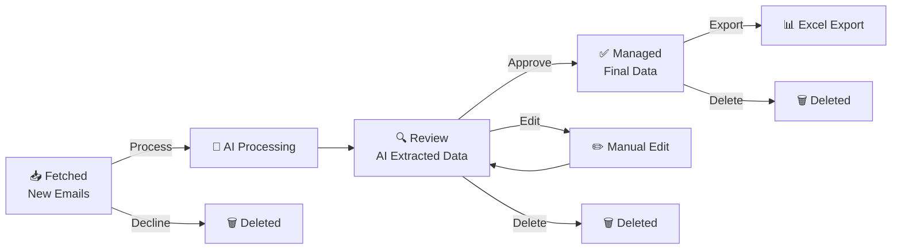

# ΕΓΧΕΙΡΙΔΙΟ ΧΡΗΣΤΗ - AEMS

## Περιεχόμενα

1. [Εισαγωγή](#εισαγωγή)
2. [Πρώτα Βήματα](#πρώτα-βήματα)
3. [Κύριο Dashboard](#κύριο-dashboard)
4. [Διαχείριση Emails](#διαχείριση-emails)
5. [Σύστημα Έγκρισης/Ακύρωσης](#σύστημα-έγκρισηςακύρωσης)
6. [Χειροκίνητη Επεξεργασία](#χειροκίνητη-επεξεργασία)
7. [Ειδοποιήσεις](#ειδοποιήσεις)
8. [Εξαγωγή Δεδομένων](#εξαγωγή-δεδομένων)
---

## Εισαγωγή

Το AEMS (Agentic Email Management System) είναι ένα σύστημα που σας βοηθά να διαχειρίζεστε αυτόματα τα emails σας και να εξάγετε σημαντικές πληροφορίες από αυτά. Το σύστημα λειτουργεί με τρία στάδια επεξεργασίας που σας δίνουν πλήρη έλεγχο.

### Τα Τρία Στάδια Επεξεργασίας

1. **📥 Fetched (Ληφθέντα)**: Νέα emails που έχουν ληφθεί από το Gmail σας
2. **🔍 Review (Έλεγχος)**: Emails που έχουν επεξεργαστεί από AI και περιμένουν την έγκρισή σας
3. **✅ Managed (Διαχειρισμένα)**: Emails που έχουν εγκριθεί και τα δεδομένα τους έχουν καταγραφεί

---

## Πρώτα Βήματα

### 1. Σύνδεση με Gmail

1. Ανοίξτε το AEMS στον browser σας
2. Κάντε κλικ στο κουμπί **"Connect Gmail"**
3. Συνδεθείτε με τον Google λογαριασμό σας
4. Δώστε τις απαραίτητες άδειες για πρόσβαση στο Gmail

### 2. Πρώτος Συγχρονισμός

Μετά τη σύνδεση:
1. Κάντε κλικ στο κουμπί **"Sync Emails"** (🔄)
2. Περιμένετε να ολοκληρωθεί ο συγχρονισμός
3. Θα δείτε τα νέα emails στην καρτέλα **"Fetched"**

---

## Κύριο Dashboard

### Επισκόπηση Interface


### Κύρια Στοιχεία

- **Header Bar**: Τίτλος και user menu
- **Tab Navigation**: Τρεις καρτέλες για τα στάδια επεξεργασίας
- **Badge Counters**: Αριθμός emails σε κάθε στάδιο
- **Email List**: Λίστα emails με actions
- **Notification Area**: Ειδοποιήσεις στην πάνω δεξιά γωνία

### Κουμπιά Ενεργειών

- **🔄 Sync**: Συγχρονισμός νέων emails
- **🗑️ Recycle Bin**: Προβολή διαγραμμένων emails
- **👤 User Menu**: Αποσύνδεση και ρυθμίσεις

---

## Διαχείριση Emails

### Καρτέλα "Fetched" (📥)

Εδώ βλέπετε τα νέα emails που έχουν ληφθεί:

#### Πληροφορίες Email
- **Θέμα**: Το subject του email
- **Αποστολέας**: Ποιος έστειλε το email
- **Ημερομηνία**: Πότε στάλθηκε
- **Κατηγορία**: Customer Inquiry, Invoice, ή Other

#### Διαθέσιμες Ενέργειες
- **Process**: Επεξεργασία με AI και μετάβαση στο Review
- **Decline**: Απόρριψη και μετακίνηση στον κάδο

### Καρτέλα "Review" (🔍)

Εδώ βλέπετε emails που έχουν επεξεργαστεί από AI:

#### Εξαγόμενα Δεδομένα
**Για Ερωτήσεις Πελατών (Customer Inquiries):**
- Όνομα πελάτη
- Email επικοινωνίας
- Τηλέφωνο
- Εταιρεία
- Υπηρεσία ενδιαφέροντος

**Για Τιμολόγια (Invoices):**
- Αριθμός τιμολογίου
- Ημερομηνία
- Πελάτης
- Ποσό
- ΦΠΑ

#### Διαθέσιμες Ενέργειες
- **Approve**: Έγκριση και μετάβαση στο Managed
- **Edit**: Επεξεργασία εξαγόμενων δεδομένων
- **Delete**: Διαγραφή email

### Καρτέλα "Managed" (✅)

Εδώ βλέπετε τα εγκεκριμένα emails:

#### Διαθέσιμες Ενέργειες
- **Delete**: Μετακίνηση στον κάδο

---

## Σύστημα Έγκρισης/Ακύρωσης

### Workflow Επεξεργασίας



### Διαδικασία Έγκρισης

1. **Στο Fetched**: Κάντε κλικ **"Process"** για AI επεξεργασία
2. **Στο Review**: Ελέγξτε τα εξαγόμενα δεδομένα
3. **Έγκριση**: Κάντε κλικ **"Approve"** αν τα δεδομένα είναι σωστά
4. **Απόρριψη**: Κάντε κλικ **"Delete"** αν υπάρχει πρόβλημα

### Μαζικές Ενέργειες

Μπορείτε να επιλέξετε πολλαπλά emails και να εκτελέσετε:
- **Bulk Process**: Επεξεργασία όλων μαζί
- **Bulk Approve**: Έγκριση όλων μαζί
- **Bulk Delete**: Διαγραφή όλων μαζί

---

## Χειροκίνητη Επεξεργασία

### Επεξεργασία Εξαγόμενων Δεδομένων

1. Στην καρτέλα **"Review"**, κάντε κλικ **"Edit"** σε ένα email
2. Θα ανοίξει ένα παράθυρο με τα εξαγόμενα δεδομένα
3. Επεξεργαστείτε τα πεδία που χρειάζονται διόρθωση
4. Κάντε κλικ **"Save Changes"**

### Πεδία Επεξεργασίας

**Ερωτησεις Πελατών (Customer Inquiry):**
- **Customer Name**: Όνομα πελάτη
- **Customer Email**: Email επικοινωνίας
- **Customer Phone**: Τηλέφωνο
- **Company**: Εταιρεία
- **Service Interest**: Υπηρεσία ενδιαφέροντος

**Τιμολόγια (Invoices):**
- **Invoice Number**: Αριθμός τιμολογίου
- **Invoice Date**: Ημερομηνία
- **Customer Name**: Όνομα πελάτη
- **Amount**: Ποσό χωρίς ΦΠΑ
- **VAT Amount**: Ποσό ΦΠΑ
- **Total Amount**: Συνολικό ποσό

---

## Ειδοποιήσεις

- **Πότε**: Όταν ληφθούν νέα emails από το Gmail
- **Περιεχόμενο**:
  - Αριθμός νέων emails
  - Κατηγοριοποίηση (αιτήματα πελατών, τιμολόγια, άλλα)
  - Χρονική σήμανση

## Εξαγωγή Δεδομένων

### Excel Export

1. Πηγαίνετε στην καρτέλα **"Managed"**
2. Κάντε κλικ **"Export to Excel"**

### Δομή Exported Files

**Customer Inquiries Excel:**
```
| Customer Name | Email | Phone | Company | Service Interest | Date |
|---------------|-------|-------|---------|------------------|------|
```

**Invoices Excel:**
```
| Invoice # | Date | Customer | Amount | VAT | Total | Email Date |
|-----------|------|----------|--------|-----|-------|-------------|
```

---

*Εγχειρίδιο Χρήστη v1.0 - AEMS Project*
*Τελευταία ενημέρωση: Αύγουστος 2025*
